<div align="center">



<br/>

[](https://linkedin.com/in/saisiddi-kalmadi-172672382/)
[](https://github.com/saisiddi)
[](mailto:kalmadisaisiddi@gmail.com)


</div>

<br/>

### 🔎 Self-Scan — `saisiddi --scan --verbose`

Same gate format I built for EV battery telemetry at iTelematics — pointed at myself.

| Rule | Domain | Result | Evidence |
| :--: | :-- | :--: | :-- |
| `R-01` | **SECURITY** | ✅ PASS | Detection engineering, threat modeling for embedded/EV systems, ethical hacking, OSINT, web app security |
| `R-02` | **AI SYSTEMS** | ✅ PASS | LLM agents, RAG pipelines, voice AI (Sarvam, Gemini), prompt design |
| `R-03` | **SHIPPED** | ✅ PASS | SIM-006: 8 detection rules, FastAPI+CLI+Streamlit, 161 tests @ 95%+ coverage, 10K-event stress test |
| `R-04` | **FOUNDER MODE** | ✅ PASS | Co-founded VachLabs; shipped a compliance layer; caught and fixed a live credential leak |
| `R-05` | **LEADERSHIP** | ✅ PASS | Ran a 500+ person hackathon; built a national event's site + registration system |

<br/>

### 🧭 Mission Log

```text
[2025 → now]  VachLabs · Co-founder
  Shipped white-label voice-AI agents (Sarvam · Gemini · Vobiz) for NBFC/EdTech clients.
  Audited two in-house codebases, picked the stronger base, then hard-wired in DNC +
  IST calling-window + circuit-breaker compliance. Caught a live credential leak mid-audit
  — rotated secrets, scrubbed history, moved on. Runs on a zero-cost stack: n8n (HF Spaces)
  + Supabase + UptimeRobot.

[2026]  iTelematics · Cybersecurity Research Intern
  Owned SIM-006 end to end — 8 detection rules (R-01→R-08) turning telemetry, identity,
  firmware and cyber signals into PASS / WARN / HARD_FAIL gates. Shipped as a FastAPI
  service + CLI + Streamlit UI on a Pydantic-validated core. 161 tests, 95%+ coverage,
  plus an independent 10,000-event stress test (concurrency, boundary fuzzing, adversarial
  inputs). Built PRD-first, through a phased AI-agent workflow with review gates.

[2026]  Truqorun · Front-End Developer (remote, AU agency)
  Shipped front-end work for 5+ Australian clients.

[—]  VaultofCodes · Ethical Hacking & Cybersecurity Intern
  Ethical hacking, OSINT.

[—]  Cluster One, S-VYASA · Technical Head
  Coordinator → Media Team Coordinator → Technical Head. Ran a 12-hour internal hackathon
  for 500+ participants — judges, faculty and logistics, end to end.

[—]  AI for Drug Free Nation · Tech Lead & Best Coordinator
  Built the event website and registration system for a 7-day national event.
  Walked away with Best Coordinator and the Creative Visionary Award.
```

<br/>

### 🧪 Builds

<table>
<tr><td width="40%"><b>SIM-006 Detection Rule Simulator</b><br/><sub>private · research internship</sub></td><td>8-rule gate engine classifying EV telemetry, identity, firmware and cyber signals into PASS / WARN / HARD_FAIL — detailed in Mission Log above.</td></tr>
<tr><td><b>VachLabs Voice Agents</b></td><td>Compliance-first white-label voice AI for NBFC/EdTech — detailed in Mission Log above.</td></tr>
<tr><td><b><a href="https://github.com/saisiddi/sentinelbms">SentinelBMS →</a></b></td><td>EV battery attack early-warning system: telemetry → rule engine (cell-voltage deviation, firmware-hash integrity, SoC/voltage consistency) → RAG explanation → triage. Built for the 1M1B × IBM SkillsBuild/AICTE internship; certificate issued 22 Sept 2026.</td></tr>
<tr><td><b>Contest Proctor</b></td><td>Chrome extension + live dashboard that logs tab switches, copy-paste and reloads during an in-person coding contest. Used live on 11 Sept 2026.</td></tr>
</table>

<br/>

### 🏆 Leadership & Recognition


<br/>

### 🛠️ Tech Stack


**Security** — detection engineering · threat modeling (embedded/EV) · ethical hacking · OSINT · web app security
**AI** — LLM agents · RAG · voice AI (Sarvam, Gemini) · prompt design

<br/>

### 📊 Live Telemetry

<div align="center">


<br/><br/>


<br/><br/>


<br/><br/>


</div>

<br/>

### 📡 Status

`● ONLINE` — `scaling VachLabs` · `hardening SIM-006` · `researching EV attack surfaces` · `open to: security internships · research roles · hackathon teams`

<br/>

<div align="center">

<picture>
  <source media="(prefers-color-scheme: dark)" srcset="https://raw.githubusercontent.com/saisiddi/saisiddi/output/github-contribution-grid-snake-dark.svg" />
  <source media="(prefers-color-scheme: light)" srcset="https://raw.githubusercontent.com/saisiddi/saisiddi/output/github-contribution-grid-snake.svg" />
  
</picture>

</div>
